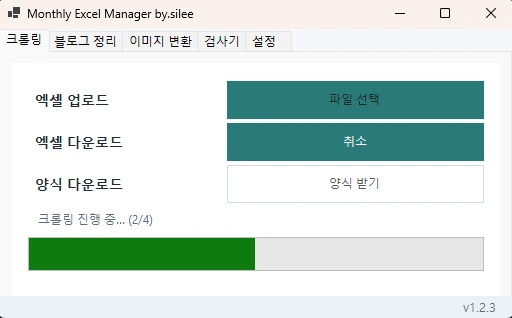
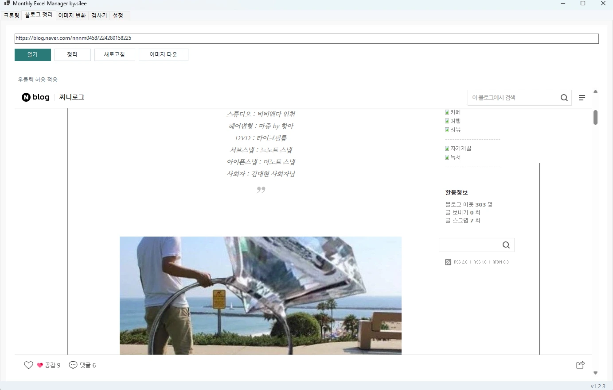
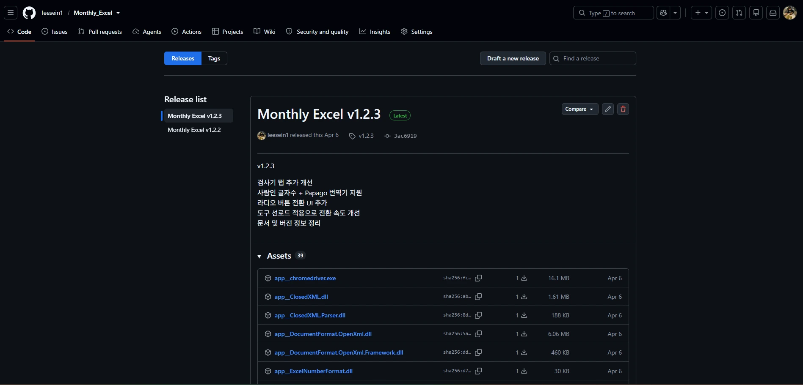

# Monthly Excel Manager


특정 업무에서 반복되던 웹 조회와 Excel 정리 작업을 줄이기 위해 만든 WinForms 프로그램입니다.

처음에는 Excel에 있는 네이버 카페 URL을 읽어 조회수, 댓글 수, 작성일을 수집하고 결과 Excel을 만드는 기능으로 시작했습니다. 실제 사용자가 업무에 쓰면서 요청이 생길 때마다 블로그 정리, 이미지 처리, 검사기, 설정, 자동 업데이트를 추가했습니다.

---

## 만든 이유

네이버 카페 게시글을 하나씩 열어 조회수, 댓글 수, 작성일을 확인한 뒤 다시 Excel에 입력하는 작업이 반복되고 있었습니다. 건수가 늘수록 확인과 입력에 시간이 많이 들었습니다.

이 작업을 줄이기 위해 Excel의 URL 목록을 읽어 필요한 정보를 수집하고 결과 파일을 생성하는 프로그램부터 만들었습니다. 이후 실제 사용 중 나온 요청을 기준으로 기능을 추가했습니다.

---

## Preview

<details>
<summary><b>크롤링</b></summary>
<br/>
<p align="center">
  
</p>
</details>

<details>
<summary><b>블로그 정리</b></summary>
<br/>
<p align="center">
  
</p>
</details>

<details>
<summary><b>GitHub Releases</b></summary>
<br/>
<p align="center">
  
</p>
</details>

---

## 주요 기능

- Excel URL 목록 기반 네이버 카페 게시글 정보 수집 및 결과 Excel 생성
- 키워드 분리와 정리
- WebView2 기반 블로그 본문 정리 및 이미지 다운로드
- 이미지 미리보기와 일괄 포맷 변환
- 사람인 글자수 도구 / Papago 검사기
- 탭 표시, 순서, 배율 설정 저장
- GitHub Releases 기반 자동 업데이트

범용 RPA나 범용 크롤러가 아니라 현재 사용 중인 업무 흐름과 대상 사이트에 맞춘 프로그램입니다.

---

## 기술

**Application**  
`C#` `.NET 8` `WinForms`

**Web Automation**  
`Selenium WebDriver` `ChromeDriver` `WebView2`

**Data / Image**  
`ClosedXML` `SixLabors.ImageSharp` `JSON`

**Distribution**  
`GitHub Releases` `PowerShell` `SHA-256`

---

## 사용하면서 바뀐 부분

처음에는 카페 크롤링만 있었습니다. 이후 실제 업무에서 필요한 기능을 순서대로 붙였습니다.

- 블로그 본문 정리와 이미지 다운로드
- 창 크기와 화면 사용성 조정
- 탭 표시·순서·배율 설정 저장
- 크롤링 백그라운드 처리와 취소
- Papago를 포함한 검사기
- GitHub Releases 기반 자동 업데이트

기능이 늘어나면서 `Pages / Handlers / Processors / Controls / UI / Utils` 단위로 코드를 분리했습니다.

Selenium 크롤링은 백그라운드 작업으로 실행합니다. `CancellationToken`으로 취소할 수 있고 진행률 표시, 중복 실행 방지, 동시 작업 수 제한을 적용했습니다.

배포는 별도 `Monthly_Excel.Launcher`가 최신 `manifest.json`을 확인하는 방식입니다. SHA-256을 비교해 필요한 파일을 갱신한 뒤 본 프로그램을 실행합니다.

`scripts/Publish-ReleaseAssets.ps1`에서는 앱과 Launcher 빌드 결과, manifest, portable ZIP을 생성합니다.

---

## 수정한 문제

### 크롤링 중 UI 멈춤

동기 방식으로 실행되던 Selenium 작업을 백그라운드 처리로 변경했습니다. 취소와 진행률 표시도 같이 추가했습니다.

### WebView2 초기화 충돌

`already initialized with a different CoreWebView2Environment` 오류와 초기 빈 화면이 발생했습니다. 중복 초기화를 막고 DOM이 준비된 뒤 정리 스크립트를 실행하도록 수정했습니다.

### 프로그램 배포

수정할 때마다 실행 파일 전체를 다시 전달하던 방식을 Launcher + GitHub Releases 구조로 바꿨습니다.

---

<details>
<summary><b>Build / Run</b></summary>
<br/>

```bash
dotnet build Monthly_Excel/Monthly_Excel.csproj
dotnet run --project Monthly_Excel/Monthly_Excel.csproj
```

```powershell
powershell -ExecutionPolicy Bypass -File .\scripts\Publish-ReleaseAssets.ps1 `
  -Version "v1.2.3" `
  -Owner "leesein1" `
  -Repository "Monthly_Excel"
```

필요 환경:

- WebView2 Runtime
- ChromeDriver

</details>
